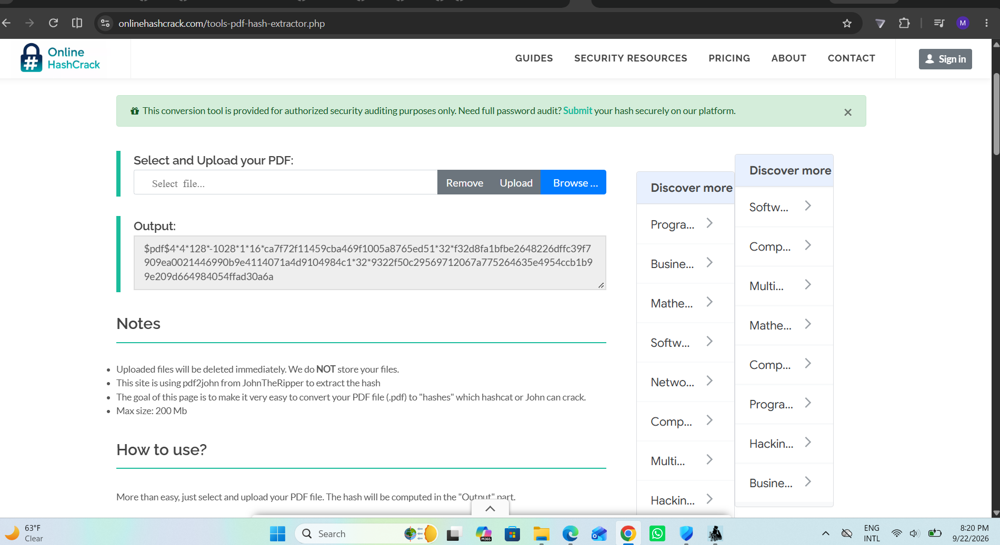
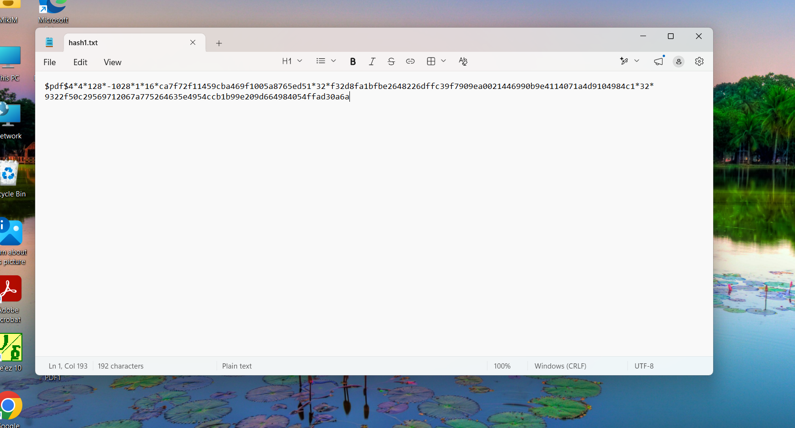
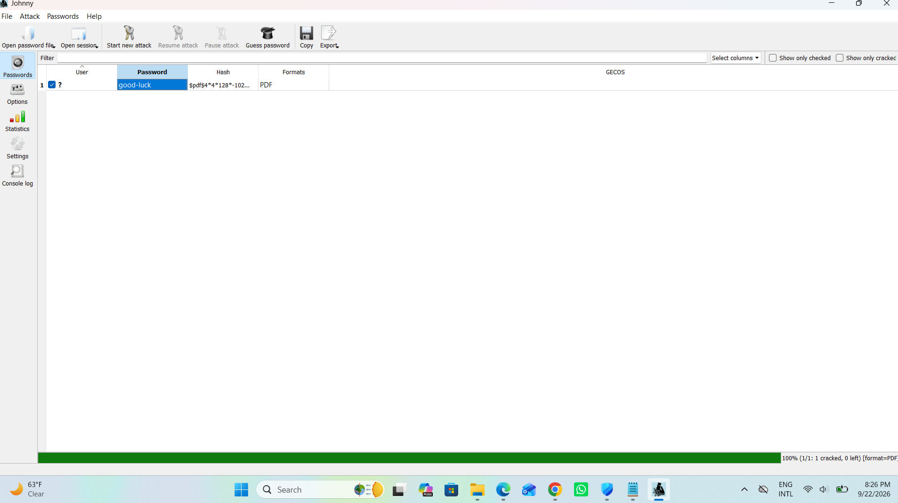

# 🔐 PM1 - Password Cracking with John the Ripper (JTR)

## 📋 Overview

This module focuses on cracking a password protected PDF file using
**John the Ripper (JTR)**, run through its graphical front end, **Johnny**,
on Windows. The goal was to extract a hash from a locked PDF, load it into
JTR, and recover the original password protecting the file.

## 🎯 Objective

-  Understand how password-protected PDF files store their protection as a hash
-  Learn to extract that hash using a PDF-to-hash conversion tool (`pdf2john`)
-  Use John the Ripper (via Johnny GUI) to perform a password-cracking attack
  against the extracted hash
-  Recover the plaintext password and capture the module flag

## 🛠️ Tools & Environment

| Tool | Purpose |
|---|---|
|  **John the Ripper (JTR)** | Password-cracking engine |
| **Johnny** | GUI front-end for JTR |
|  **OnlineHashCrack.com  PDF Hash Extractor** | Web-based `pdf2john` tool to extract the hash from the PDF |
|  **Notepad** | Used to store the extracted hash locally |
|  **OS** | Windows |

**🎯 Target file:** `My Locked PDF1.pdf` (password-protected PDF provided for the exercise)

## 🔍 Methodology

### 1️ Identify the hash format

PDF password protection is stored internally as a hash that encodes the
encryption algorithm and parameters. To crack it with JTR, the hash first
needs to be extracted in a format JTR understands (the `pdf2john` format).

### 2️ Extract the hash

Rather than installing a local Python/Perl toolchain, used the web-based
**OnlineHashCrack PDF Hash Extractor**
(`onlinehashcrack.com/tools-pdf-hash-extractor.php`), which runs
`pdf2john` under the hood.

1. Uploaded `My Locked PDF1.pdf` to the tool
2. Tool returned a hash string in the standard `$pdf$...` format:

  

> ⚠️ **Note on trust:** Uploading files to third-party online tools sends
> file contents to an external server. The tool's own notice states files
> are deleted immediately and not stored, which is why it was acceptable
> for this lab exercise but this approach should **not** be used for
> sensitive or real world PDFs. In a production/real engagement,
> `pdf2john.pl` should be run locally instead.

### 3️ Save the hash for cracking

Copied the extracted hash string into a local text file, `hash1.txt`,
so it could be loaded directly into Johnny.

 

### 4️ Load the hash into Johnny

-  Opened **Johnny** (JTR GUI)
- Used **Open password file** to load `hash1.txt`
- Johnny automatically recognized the format as `PDF`

### 5️ Run the attack

-  Started a new attack via **Start new attack**
-  Johnny/JTR ran its default cracking mode (dictionary/wordlist-based)
  against the loaded hash

### 6️ Password recovered

The attack completed with a ** 100% success rate (1/1 cracked, 0 left)**.

 

| User | Password | Hash (truncated) | Format |
|---|---|---|---|
| ❓ | `good-luck` | `$pdf$4*4*128*-102...` | PDF |

### 7️ Unlock the PDF and capture the flag

Used the recovered password to open `My Locked PDF1.pdf`, revealing
** Flag1** for this module.

 

## 🧠 Key Takeaways

-  Password-protected PDFs can be converted into a crackable hash format
  using `pdf2john`, independent of the PDF's actual content
-  John the Ripper (via Johnny) can automatically detect the hash format
  and run an appropriate cracking mode without manual configuration
-  Weak/dictionary style passwords (even ones that look like short phrases)
  are quickly recoverable with basic wordlist attacks reinforcing why
  strong, random passphrases matter for document encryption
- Online conversion tools are convenient for learning labs but introduce
  a trust/privacy trade off that isn't appropriate for real sensitive data

