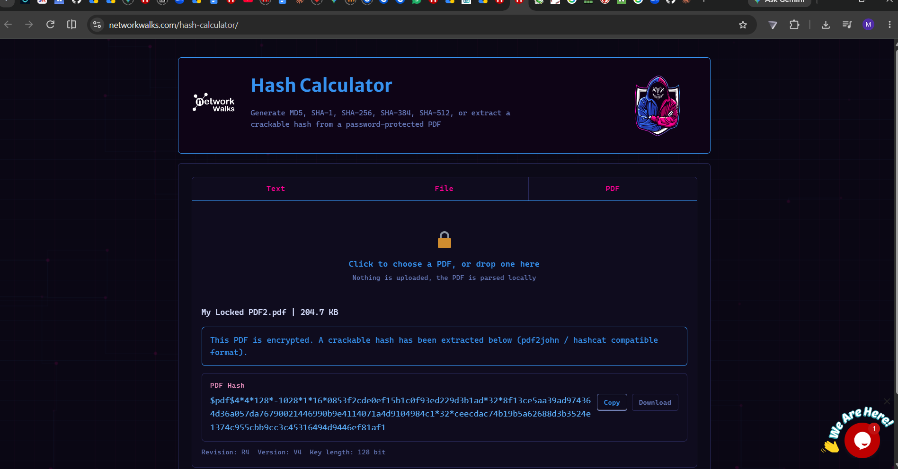
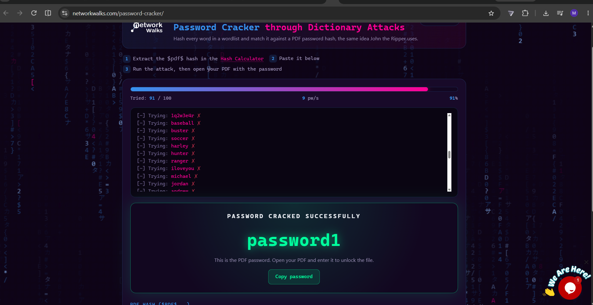
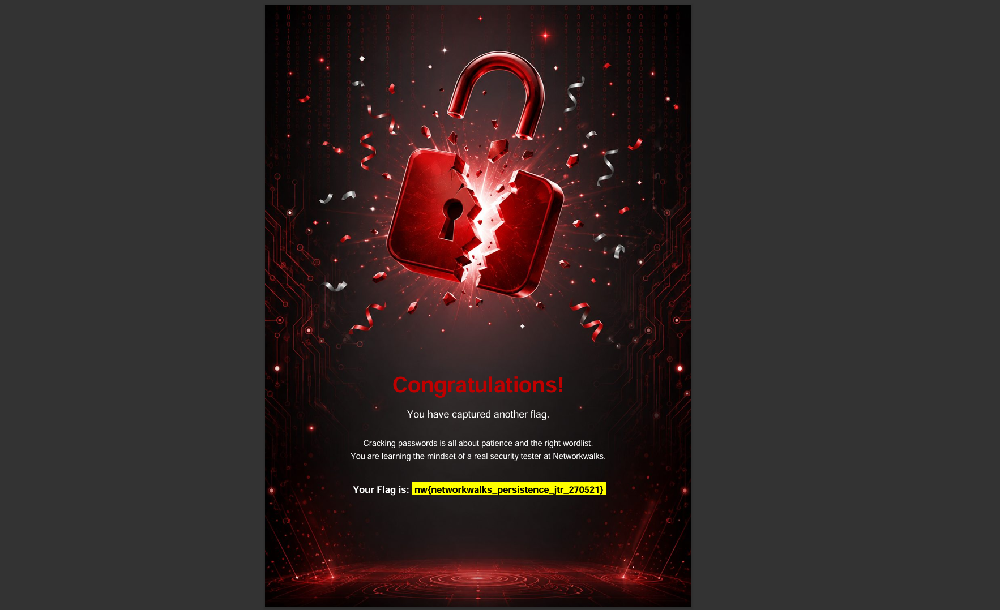
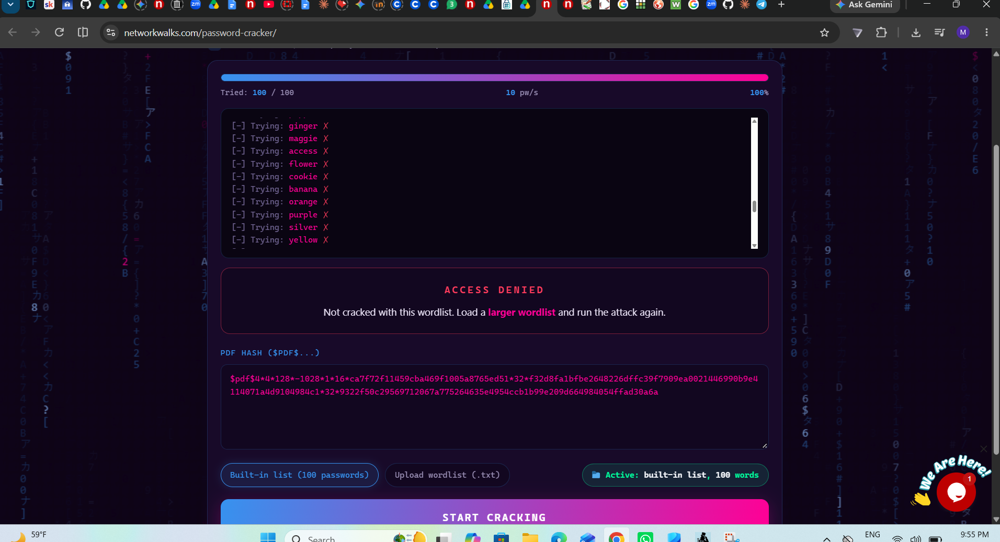
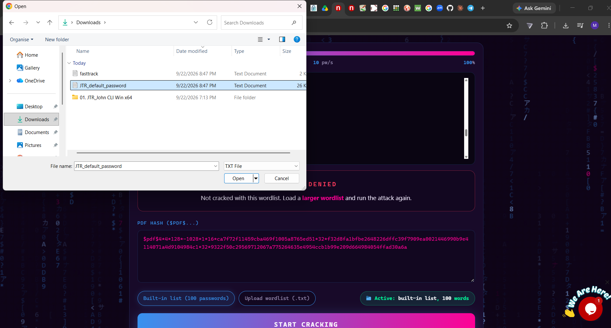
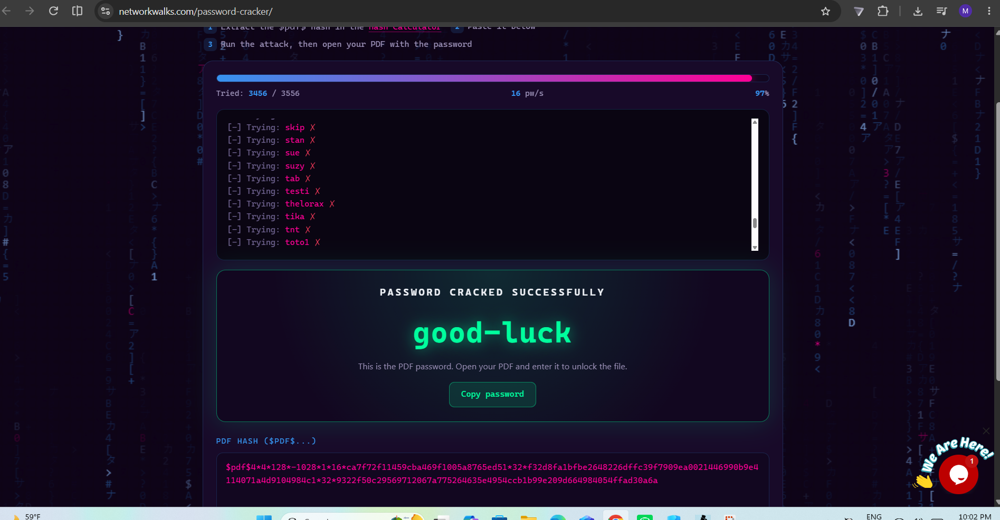

# 🔐 PM2 - Password Cracking with Networkwalks' Hash Calculator & Password Cracker

## 📋 Overview
This module uses Networkwalks' own web based tools the **Hash Calculator**
and the **Password Cracker (Dictionary Attack)** to extract a crackable
hash from a locked PDF and recover its password entirely in browser,
without installing John the Ripper locally.

## 🎯 Objective

- Extract a `pdf` (pdf2john/hashcat-compatible) hash from a
  password-protected PDF using Networkwalks' Hash Calculator
- Feed that hash into Networkwalks' Password Cracker and run a
  dictionary attack against it
- Understand how wordlist size/coverage affects whether an attack
  succeeds or fails
- Recover the password and capture the module flag

## 🛠️ Tools & Environment
| Tool | Purpose |
|---|---|
|  **Networkwalks Hash Calculator** (`networkwalks.com/hash-calculator/`) | Extracts a `pdf` hash locally in-browser (no upload) |
| **Networkwalks Password Cracker** (`networkwalks.com/password-cracker/`) | Runs a dictionary attack against a pasted `pdf` hash |
| **OS** | Windows |

**🎯 Target files:** `My Locked PDF2.pdf` and `My Locked PDF1.pdf`

## 🔍 Methodology

### Part A Cracking `My Locked PDF2.pdf`

#### 1️ Extract the hash

Opened the Networkwalks **Hash Calculator**, selected the **PDF** tab,
and loaded `My Locked PDF2.pdf`. The PDF is parsed **locally in-browser**
(nothing uploaded), and the tool returned an encrypted PDF hash in
pdf2john/hashcat-compatible format (Revision R4, Version V4, 128-bit key).

#### 2️ Run the dictionary attack

Pasted the extracted hash into the **Password Cracker** tool, which hashes
every word in a wordlist and checks it against the PDF hash the same
underlying idea as John the Ripper. Using the built-in wordlist
(100 passwords), the attack progressed to completion.

#### 3️ Password cracked

The built in 100 word list was enough this time the attack succeeded.

**Result:** `PASSWORD CRACKED SUCCESSFULLY` 91/100 tried, password recovered.

#### 4️ Flag captured

Used the recovered password to unlock `My Locked PDF2.pdf` and captured
the flag for this module.

### Part B  Revisiting `My Locked PDF1.pdf`

## ⚠️ Problems Encountered

### Problem: Built-in wordlist too small to crack `My Locked PDF1.pdf`

**What happened:**

Reused the `pdf` hash for `My Locked PDF1.pdf` (the same hash extracted
back in PM1) and ran it through the Password Cracker using the tool's
**built-in wordlist (100 passwords)**. The attack ran through all 100
attempts without finding a match.

**Result:** `ACCESS DENIED — Not cracked with this wordlist.`

**Solution:**

This wasn't a tool or hash problem it confirmed the correct password
simply wasn't included in the small built-in list. The tool itself
suggested the fix: *"Load a larger wordlist and run the attack again."*

### Fix: Switched to a larger custom wordlist

**What I did:**
Uploaded a much larger wordlist  `JTR_default_password.txt`
(3,500+ entries) instead of relying on the built-in 100-word list.

**Result:**
Re-ran the attack with the larger list. The correct password was found
at 97% progress (3,456 / 3,556 words tried).

`PASSWORD CRACKED SUCCESSFULLY` password `[good-luck]`

(matches the password recovered for the same hash in PM1 using JTR/Johnny,
confirming both tools agree on the result).

**Lesson learned:**
A dictionary attack is only as strong as its wordlist. A failed crack
attempt doesn't necessarily mean the tool, hash, or method is wrong it
can simply mean the wordlist doesn't contain the right word. Scaling up
from 100 to 3,500+ candidate passwords turned a failed attempt into a
successful one.

## 🧠 Key Takeaways

-  Networkwalks' Hash Calculator can extract a pdf2john compatible hash
  entirely client-side, without uploading the PDF anywhere
-  A dictionary attack is only as good as its wordlist a password
  cracking attempt can fail not because a tool doesn't work, but simply
  because the correct password isn't in the list being tried
-  Expanding from a 100-word built-in list to a 3,500+ word list turned
  a failed ("ACCESS DENIED") attempt into a successful crack
-  Cross-checking the same hash with two different tools (JTR/Johnny in
  PM1, Networkwalks' web cracker here) and getting the same recovered
  password is a good way to validate results
- Bigger/better wordlists (e.g. `rockyou.txt`) matter more for real
  password audits than the cracking tool itself
